# home-market

An online shop for everyday things: backpacks, a kettle, headphones, a
desk fan, a phone, sneakers, twenty-eight products in eight categories,
each with a photo, a price and a stock. Anyone can browse, search and
open a product. With an account you put things in a cart, check out
with a card and get an order; you sell your own products with a photo,
watch them sell, like what you see and write to a seller from their
product. Nobody can touch anyone else's listing, cart, order or mail,
and the card you pay with is never kept.

Two projects in one repository: `api`, an ASP.NET Core 8 Web API on
Entity Framework Core and SQLite, and `web`, an Angular 21 application
with Bootstrap, Font Awesome and ngx-toastr.

## Screenshots


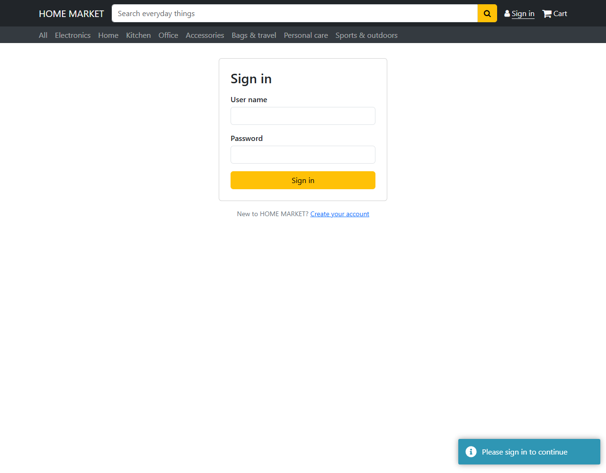

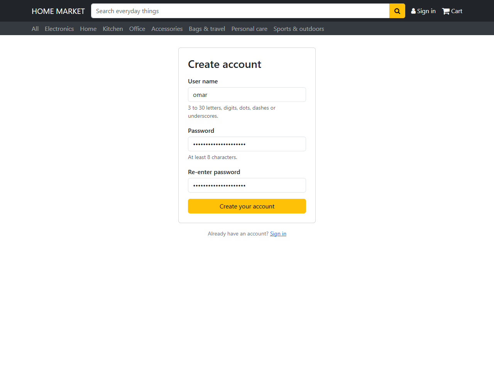

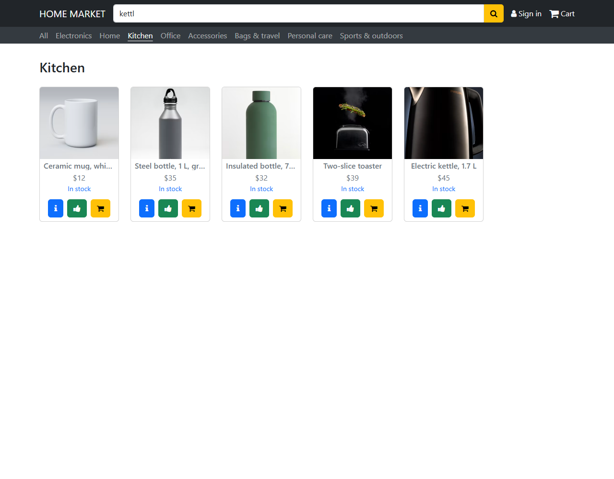

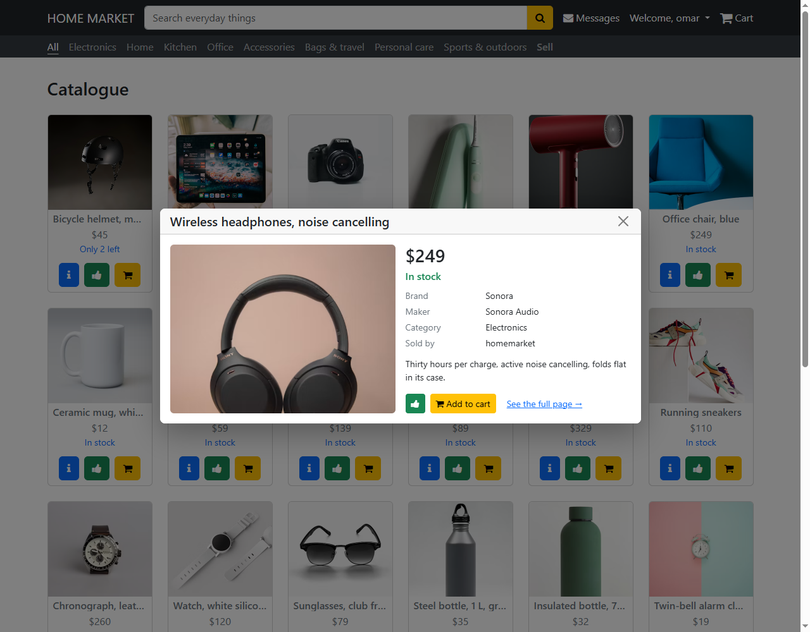


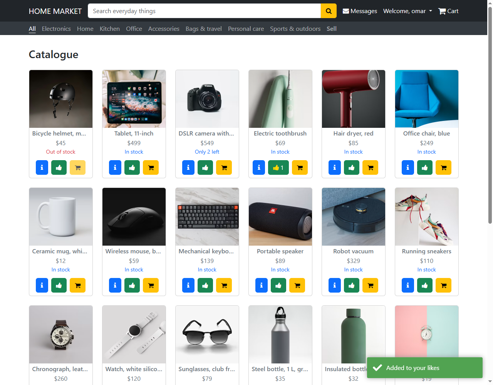


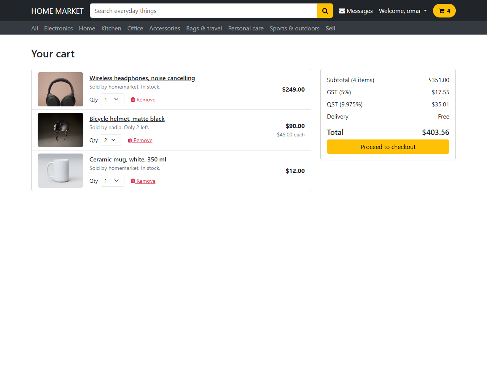


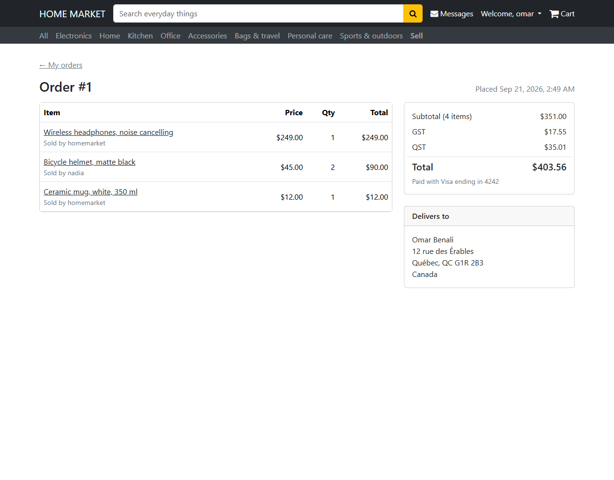

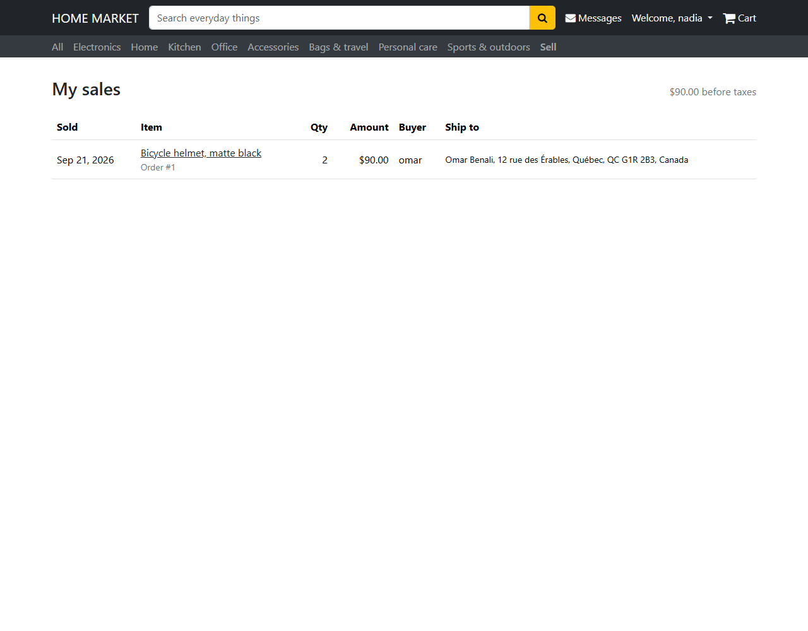


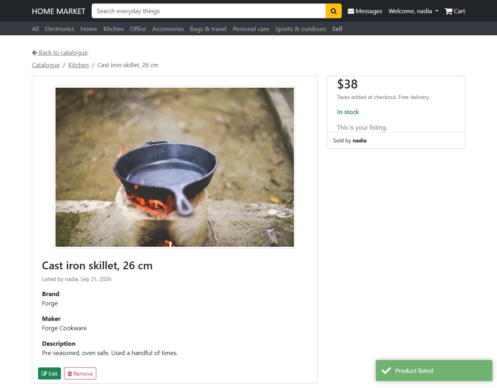

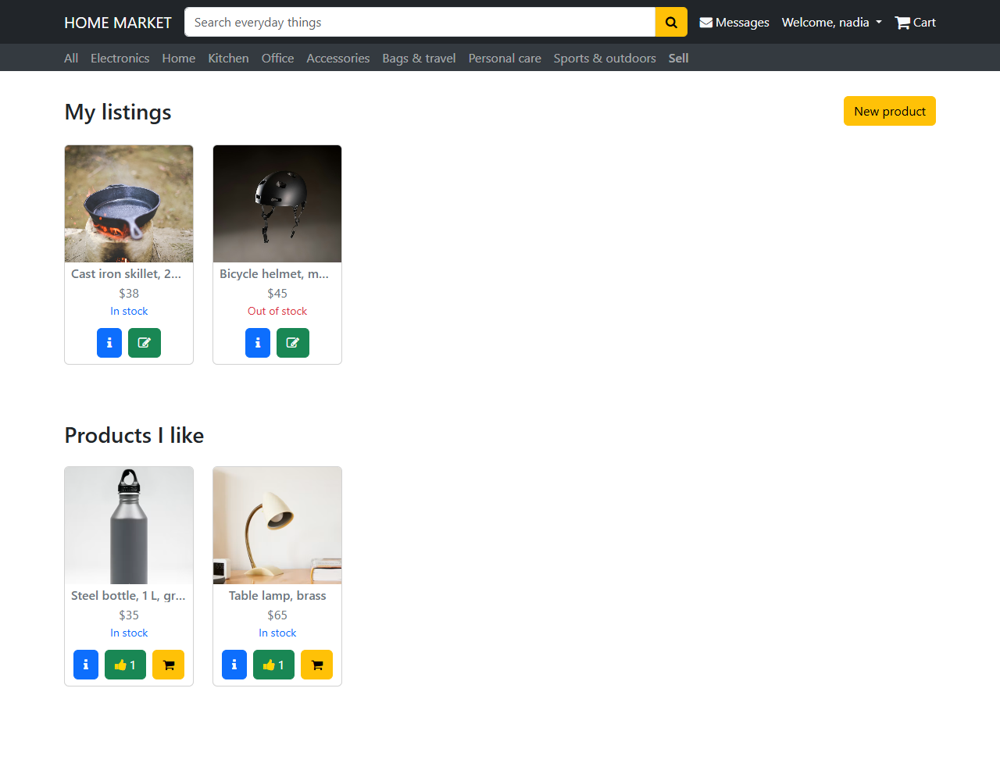

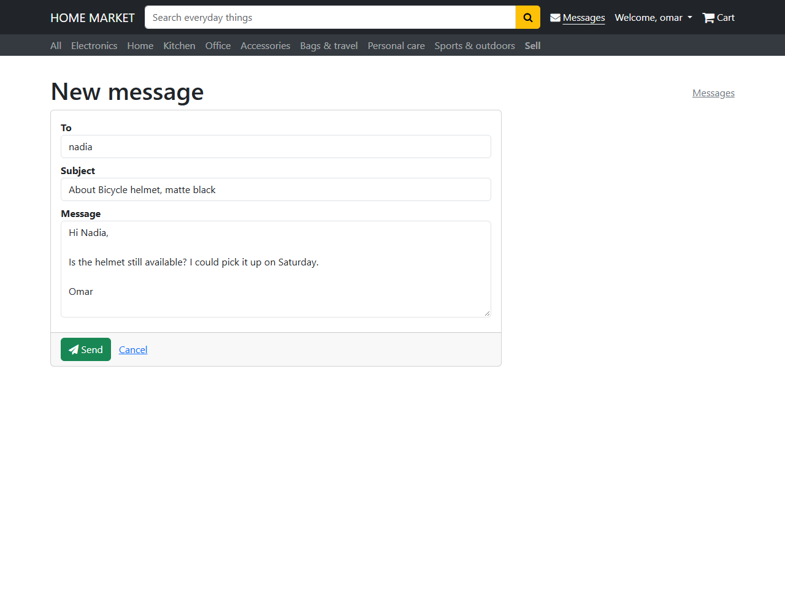

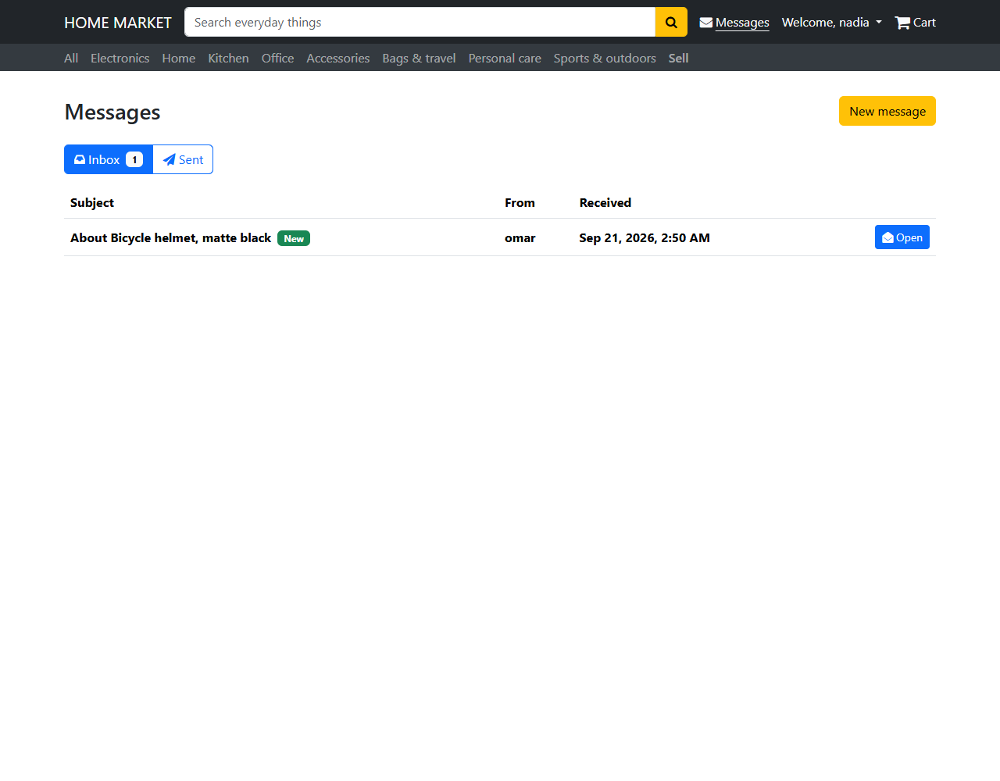

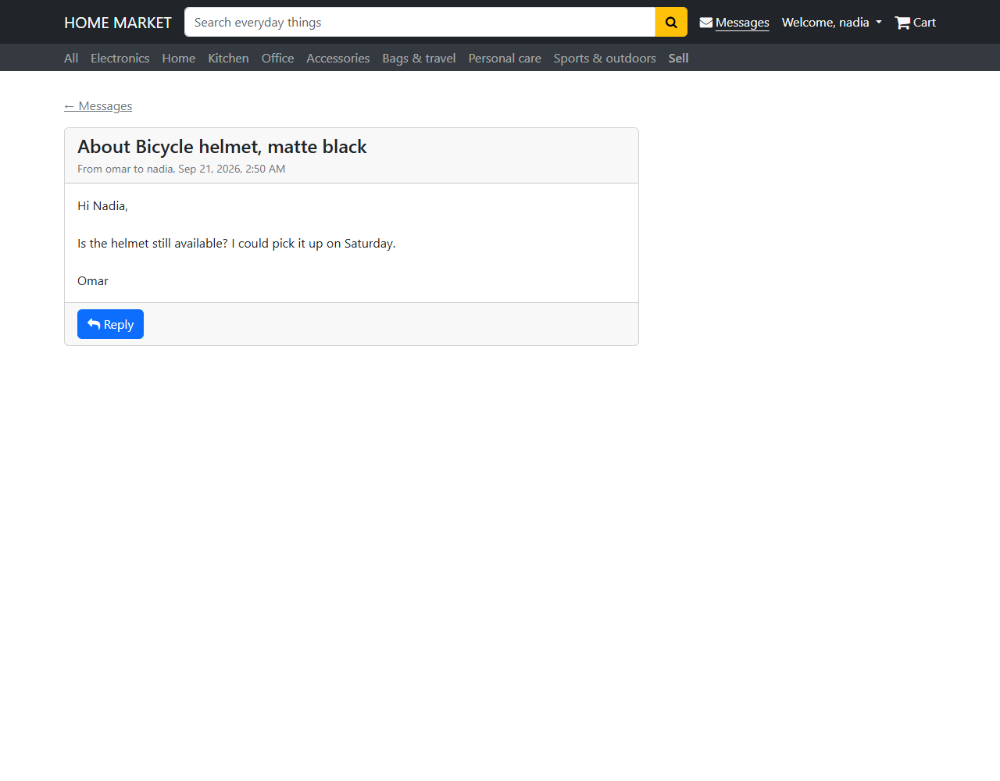

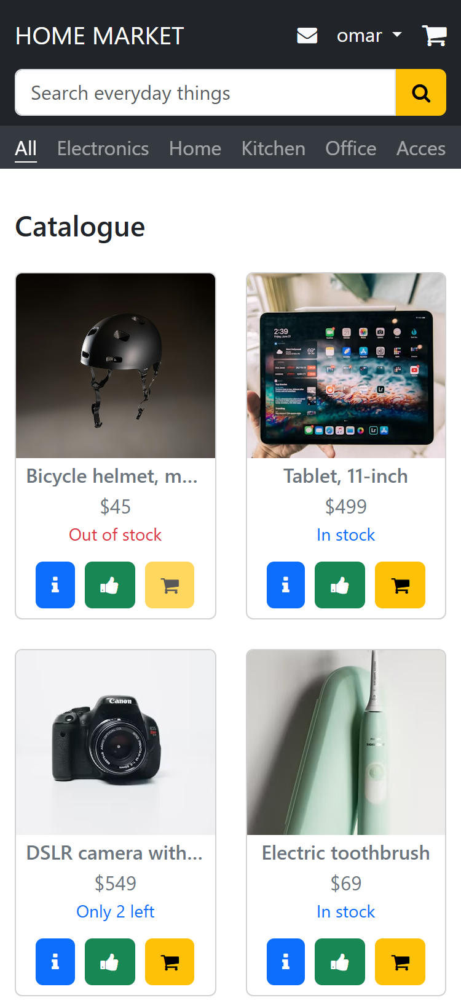

## How it works

**The catalogue is public, the rest is not.** `GET /api/products`
answers anyone, narrowed by `?q=` on the title, brand and maker and by
`?category=`; `GET /api/products/categories` lists the eight
categories with their counts and `GET /api/products/{id}` one product.
`liked` and `mine` in the answer are computed for the caller when there
is a token, false otherwise. To buy, like, sell, change, remove, upload
or write, the route is `[Authorize]` and the account comes from the
token, never from a header or the body.

**A cart on the server, one per account.** `GET /api/cart` is mine and
mine only; `POST /api/cart/lines` adds a product (adding what is there
adds to its quantity), `PUT /api/cart/lines/{productId}` sets a
quantity, `DELETE` drops a line, and each call answers with the whole
cart, subtotal, GST, QST and total included, so the client never adds
up. Nothing of my own goes in, nothing missing, never more than the
stock and never more than ten of a thing. The badge in the bar and the
cart page read one signal that every answer replaces.

**Checkout in one transaction.** `POST /api/orders` takes what the
order of Microsoft's [eShop reference](https://github.com/dotnet/eShop)
takes: the address (street, city, province, postal code, country) and
the card (number, name on the card, expiration, security code). The
stock is checked line by line, the card is charged for the total, the
lines are copied with the title and price of the day, the stock goes
down and the cart is emptied, all in one `SaveChanges`. A refused card,
an empty cart or a short stock writes nothing and says why (402, 400,
409). The order keeps the card's brand, its last four digits and the
reference the provider gave the charge, nothing else; the number, the
name, the expiry and the code are not in the database, not in the logs,
not in the answer. `GET /api/orders` and `GET /api/orders/{id}` answer
the buyer only; `GET /api/orders/sales` gives a seller the lines others
bought from them, with where to ship, and not the buyer's card.

**The payment provider is one interface away.** `OrderService` charges
through `IPaymentGateway`: a `PaymentRequest` (amount, currency,
description, the card) in, a `PaymentResult` (accepted or the reason,
brand, last four, reference) out. The implementation is chosen in
`Program`; `SimulatedPayments` holds the place until a provider is
plugged in, answering as one would (Luhn check, expiry, security code,
the provider's usual test number for a decline, a reference) without
anything leaving the process. A Stripe or Moneris gateway is one more
class behind the same interface, with its keys in configuration.

**Least privilege on every listing.** `ProductService` changes or
removes a product only when the seller id in the token is the seller
id on the row; another account gets 403, a missing id 404. A listing
must name one of the shop's categories and say how many are in stock.
Liking is idempotent and counted once per account, through a join
table the database keeps unique. The store account that owns the
opening catalogue has no password hash, so nobody can sign in as it or
write to it.

**A photo is what its bytes say.** The upload route reads the first
bytes of the file and accepts only a JPEG, PNG, GIF or WebP signature,
5 MB at most; it stores the file under a random name with the
extension the bytes call for and returns that name. The name the client
sent, `../../evil.exe` for instance, is never used. A listing may then
name that file, or keep the address it already had; any other value, a
foreign URL or a path, is a 400.

**Mail that only its two parties can open.** A message has a sender and
a recipient, both accounts; the sender is the token, the recipient a
user name that must belong to a member who can sign in. The inbox is
what was sent to me, the sent folder what I sent, and a message by its
id answers its sender and its recipient only: for anyone else it is a
404, not a 403 that would confirm it exists. Only the recipient can
mark it read, which opening it does.

**Accounts as in the other repositories.** Passwords hashed with
`PasswordHasher`, the same 401 for a wrong name and a wrong password,
five attempts a minute per client address, a JWT signed with a key that
lives outside the repository, hardening headers on every answer, CORS
for the front end only. Sign up and sign in are pages of their own,
each linking to the other; there is no password recovery yet, as in
the `Identity.API` of eShop, and it is the next step, behind an
`IEmailSender` the way the payment sits behind `IPaymentGateway`.

**Nobody is asked to sign in ahead of time.** A visitor sees the same
buttons as a member: like, cart, Message on every card, in the quick
view and on the product page. The first click on any of them says
"Please sign in to continue", opens the sign-in page, and brings the
visitor back where they were once they are in (`SignInPrompt`, and the
route guard does the same for the cart, the checkout, the orders and
the messages). The API refuses the same actions with a 401 whatever the
front end does.

**The page and the quick view.** The photo and the title of a card open
the product page, as on Amazon or in eShop; the small blue button opens
a quick view, a native `<dialog>` with the photo, the price, the stock,
the brand, the maker, the description, the same like and cart buttons
as the card, and a link to the full page. Escape, the close button or a
click outside close it. The product page has a Back to catalogue link,
a breadcrumb through the category, the buy box (price, stock, quantity,
Add to cart) and, under it, the seller with a small Message pill, the
way eBay places its seller box; the like is a small square with its
count, as on the cards.

**Two bars, as on any shop.** The first holds the brand, the search box
and the cart, with a Sign in link for a visitor and, for a member,
Messages and an account menu (my products, my orders, my sales, sell,
sign out).
Empty, the cart is a plain icon; with something in it, a filled pill
with the count next to the icon, never a badge over it, as in eShop's
`CartMenu`. The second bar is the strip of categories, which scrolls
sideways on a phone. Search and category are query parameters of the
catalogue page, so a result can be shared. The product page carries a
buy box with the price, the stock, a quantity and Add to cart; a card
carries a small cart button. Both add and open the cart.

**One grid, four places.** `ProductList` draws the cards; the front
page, the catalogue page and the two lists of My products use it with
`source` set to `all`, `mine` or `liked`. `ProductCard` shows the
quick view button to everyone, a like and a cart button to members, an
edit button to the seller; the list owns the one `QuickView` dialog, so
a like given there shows on the card too. `ProductForm` serves both Sell
and Edit: with an id in the address it loads the product and, if it is
not mine, goes back to the product page with a message.

**The photos are linked, not stored.** The twenty-eight opening
products point at public pictures on Unsplash; the card asks for a
400 px crop, the page for 900 px, the cart for 160 px. Uploaded photos
are served by the API from its `images` folder, which the repository
ignores.

## Running it

The API, from `api/src/HomeMarket.Api`:

```bash
dotnet run --launch-profile http
```

It listens on `http://localhost:5130`, creates `market.db` with the
store account and the catalogue on first start, serves uploads under
`/images` and Swagger at `/swagger`. To keep the same signing key
between runs while developing:

```bash
dotnet user-secrets set "Jwt:Key" "a long random string of at least 32 characters"
```

The web app, from `web`:

```bash
npm install
npm start
```

Open `http://localhost:4200/`, browse, create an account from Sign up,
sign in from the Sign in link, or just click a like and let the shop
walk you there.

## Tests

From `api`:

```bash
dotnet test
```

Fifty-two xUnit tests on the five controllers, one behaviour each,
named `Method_Condition_Result` and laid out as Given, When, Then. The
services behind a controller are Moq substitutes and the data comes
from AutoFixture; every test builds its own substitutes and its own
controller, nothing is shared between tests, so a test states what the
service will answer, calls the action as the account named by the
token (or as a visitor) and checks the result: the catalogue for nobody and for a member with a
search and a category, 404 for a missing product, 201 pointing at a new
listing, 400 for a photo the server never stored or a category not in
the shop, 403 on someone else's listing, 204 on a like, the uploaded
photo by its name and address, the inbox and the sent folder, 404 for a
message of somebody else, 403 when the sender marks it read, the cart
with its totals, 404, 400 and 409 when a product is missing, mine or
short, 201 for a paid order, 402 with the reason for a refused card, 400
for an empty cart, 409 when the stock went meanwhile, and the sales of
a seller. No database and no HTTP host: `tests/` next to `src/`, the
project `HomeMarket.Api.Tests`.

From `web`:

```bash
npm test
```

Eighty-six Vitest tests through `TestBed`: the session service, the
interceptor, the guard, the sign-in prompt, the sign-in and sign-up
pages and the API messages; the product, cart and
message services against `HttpTestingController`; the two bars for a
visitor and a member, with the search and the cart count; the card, its
like and cart buttons for everyone and its edit button for the seller; the quick view
that opens with a product and tells the list when it closes; the list
with its three sources and its likes; the product page with its buy box
and its quantities; the form for a new and for an existing product; the
cart page with its lines, quantities and removals; the two shapes of
the cart in the bar; the checkout that places an order, forgets the
card and empties the cart, or keeps the cart when the card is refused; the orders, one order and the sales; the
inbox and sent folders, the opened message and the New message form.
`npm run lint` runs angular-eslint, `npm run coverage` writes the lcov
report.

## Stack

ASP.NET Core 8 Web API, Entity Framework Core 8 with SQLite,
`PasswordHasher`, JWT bearer authentication, the built-in rate limiter,
xUnit with Moq and AutoFixture. Angular 21 with standalone
components, signals, `input()` and `output()`, template forms, functional
guard and interceptor, ngx-toastr 20, Font Awesome 4, Bootstrap 5.3
through npm with only the parts the pages use; Vitest.

## Résumé

Une boutique en ligne pour les objets de tous les jours : vingt-huit
produits dans huit catégories, chacun avec photo, prix et stock. Tout le
monde parcourt le catalogue, cherche, ouvre une fiche. Avec un compte,
on met des produits dans un panier tenu par le serveur, on passe à la
caisse avec une carte (passerelle de paiement derrière une interface,
carte jamais conservée), on reçoit une
commande avec ses lignes figées au prix du jour et les taxes du Québec,
on vend ses propres produits, on suit ses ventes, on aime des fiches et
on écrit au vendeur. Un visiteur voit les mêmes boutons qu'un membre et
n'est invité à se connecter qu'au premier clic, puis revient où il
était. Personne ne peut toucher l'annonce, le panier, la
commande ni le courrier d'un autre : l'identité vient du jeton, jamais
d'un en-tête. Cinquante-deux tests xUnit sur les contrôleurs (Moq, AutoFixture, Etant donné / Lorsque / Alors) et quatre-vingt-six tests Vitest.

## Licence

MIT. See [LICENSE](LICENSE). The photos are public pictures on
[Unsplash](https://unsplash.com/license), linked by URL.
